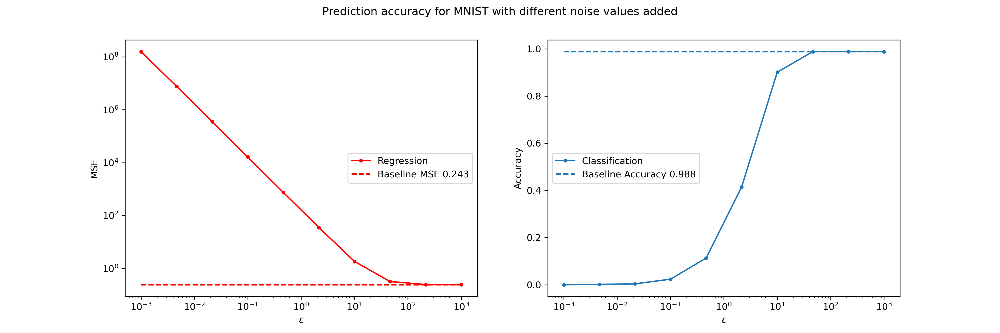

# Differential privacy project
Author: Andreas Lau Hansen, s194235@dtu.dk

Special course in Responsible AI Spring 2023

## Task

The task is to apply differential privacy to MNIST labels and perform neural network training.

In task 1, I perform a classification of the MNIST digit classes. Here the labels are one-hot vectors of the class.

In task 2, I do regression of the MNIST values from the images. Here the labels are real-valued numbers from 0 to 9.

In both cases, a Laplace mechanism is applied to the labels and the 𝝐-differentiability of the data is analysed. The scale of the Laplace noise added is determined to be $s = \Delta f / \epsilon$, where a sweep over $\epsilon$ is performed.

# Analysis of the sensitivity function
Here I calculate of the sensitivity function $\Delta f$ for each of the tasks.

We have two databases $\mathcal{D}$ and $\mathcal{D'}$ that differ by only a single record.
The sensitivity function is defined as 

$$ \Delta f = \max_{\mathcal{D},\mathcal{D'}}\lVert f(D)-f(D')\rVert_{1} $$

Since you need to find the maximum values that the difference can be among any two data points you arrive at the following.

## Classification
Here the numbers 0-9 are one-hot encoded. So the numbers can differ in at most one position, in fact choosing any two numbers yield the same result. Here one example is shown
$$\Delta f = \lVert[1 0 0 0 0 0 0 0 0] - [0 0 0 1 0 0 0 0 0]\rVert_{1}= 2$$

One can cross-check with numpy:
```python
>>> a = np.array([1,0,0,0,0,0,0,0,0])
>>> b = np.array([0,0,0,1,0,0,0,0,0])
>>> f = np.linalg.norm(a-b, ord=1)
Out: f = 2
``` 

## Regression
This basically becomes `(n_labels - 1)`, since the labels are the values 0, 1, …, 9, and the maximum obtainable difference is:
$$\Delta f = \lVert 9 - 0 \rVert_{1}= 9$$

```python
>>> f = np.linalg.norm(9-0, ord=1)
Out: f = 9
``` 

# Performance tradeoff
Plots showing the performance trade-off between privacy and accuracy / MSE.
- For the classification model: accuracy vs. 𝝐
- For the Regression model: MSE vs. 𝝐

The figure below shows the regression model on the left and the classification model on the right. Note that both axes are log scale. The baseline model is the model without noise. 
- For the regression model it is clear that the MSE follows a power law according to the value of $\epsilon$. 
- The classification model exhibits a much sharper shift in accucacy; for small $\epsilon$-values it is basically useless and then the accuracy suddenly increases fast.

<p align="center">
  
</p>

Remember that a small $\epsilon$ would result in greater privacy, while a larger $\epsilon$ would result in less.

# Other technical considerations
When you add noise to training labels (vectors), then you might get negative values. This is okay in DP framework. But should be fixed before training. This was done by clamping (both) and rounding (only classifcation) the values.